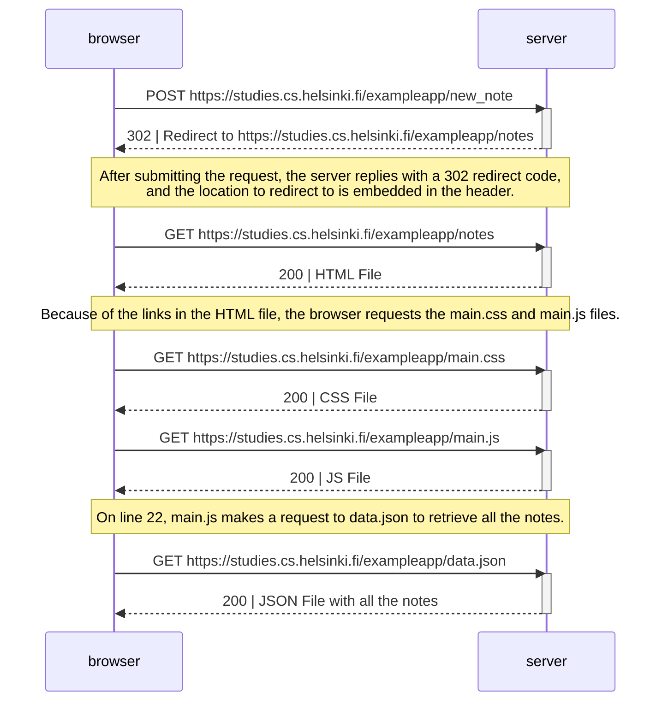

```mermaid
sequenceDiagram

    participant browser
    participant server

    browser->>server:POST https://studies.cs.helsinki.fi/exampleapp/new_note
    activate server
    server-->>browser: 302 | Redirect to https://studies.cs.helsinki.fi/exampleapp/notes
    deactivate server

    Note over browser, server: After submitting the request, the server replies with a 302 redirect code,<br> and the location to redirect to is embedded in the header.

    browser->>server: GET https://studies.cs.helsinki.fi/exampleapp/notes
    activate server
    server-->>browser: 200 | HTML File
    deactivate server

    Note over browser, server: Because of the links in the HTML file, the browser requests the main.css and main.js files.

    browser->>server: GET https://studies.cs.helsinki.fi/exampleapp/main.css
    activate server
    server-->>browser: 200 | CSS File
    deactivate server

    browser->>server: GET https://studies.cs.helsinki.fi/exampleapp/main.js
    activate server
    server-->>browser: 200 | JS File
    deactivate server

    Note over browser, server: On line 22, main.js makes a request to data.json to retrieve all the notes.

    browser->>server: GET https://studies.cs.helsinki.fi/exampleapp/data.json
    activate server
    server-->>browser: 200 | JSON File with all the notes
    deactivate server

```