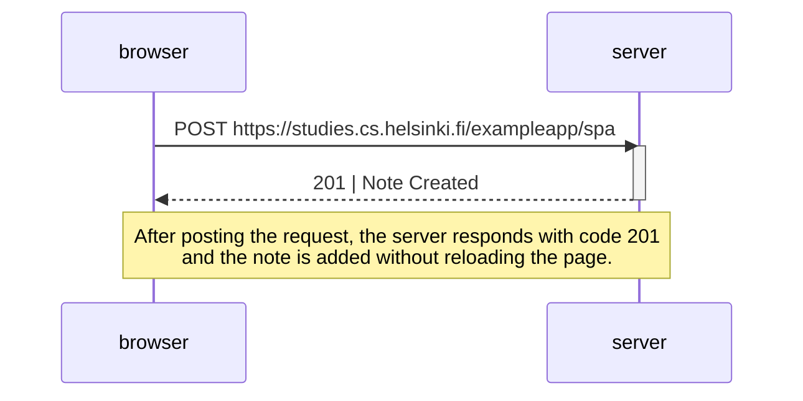

```mermaid
sequenceDiagram

    participant browser
    participant server

    browser->>server: POST https://studies.cs.helsinki.fi/exampleapp/spa
    activate server
    server-->>browser: 201 | Note Created
    deactivate server

    Note over browser,server: After posting the request, the server responds with code 201 <br> and the note is added without reloading the page.

```
